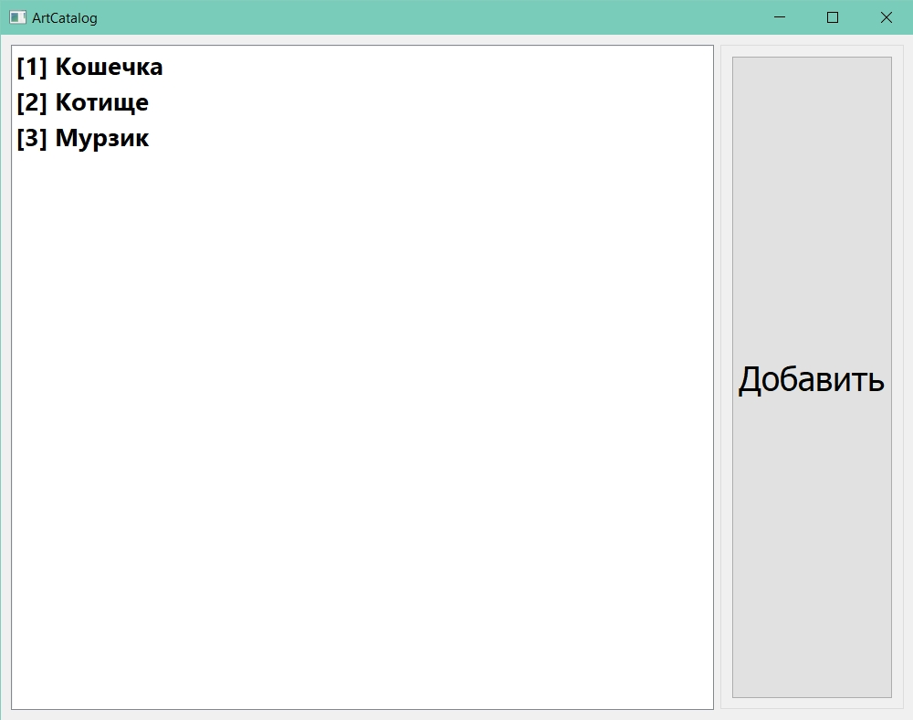
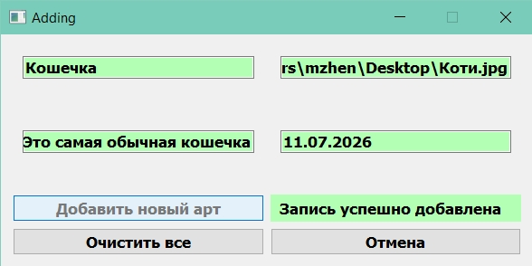
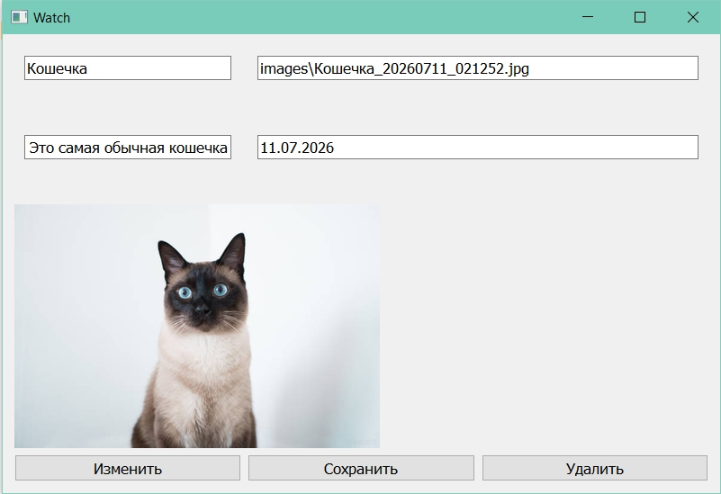
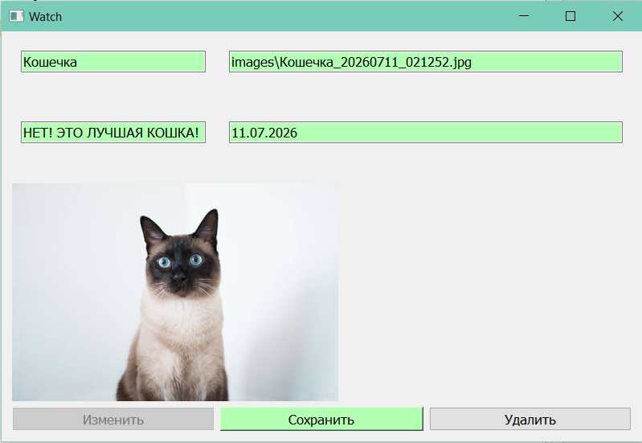

# ArtCatalog
Учебное задание на создание архива артов с использованием изученного материала за год

## Запуск проекта
Разработано на Python 3.11.0. Рекомендуется использовать именно эту версию.

1. Установите Python 3.11 с [python.org](https://www.python.org/downloads/release/python-3110/)
2. Создайте виртуальное окружение: `py -3.11 -m venv venv`
3. Активируйте:
   - Windows: `venv\Scripts\activate`
   - macOS/Linux: `source venv/bin/activate`
4. Установите зависимости: `pip install -r requirements.txt`
5. Запустите: `python main.py`

## Структура проекта

- `main.py` — Точка входа, главное окно, окна добавления/просмотра
- `validator.py` — Класс Validator: проверка имени, даты, пути
- `ui.main.py` — UI часть кода главного окна и виджетов
- `images/` — Папка для загруженных изображений (создается автоматически)
- `screenshots/` — Скриншоты приложения
- `database.db` — SQLite база данных (создаётся автоматически)

## Функционал

- Добавление записи с копированием изображения в локальную папку
- Проверка полей: имя, дата (ДД.ММ.ГГГГ), путь к файлу, формат изображения
- Просмотр записи: данные, изображение с масштабированием через Pillow
- Редактирование: изменение имени, даты, комментария с повторной проверкой
- Удаление записи с подтверждением и удалением файла изображения
- Автоматическое обновление списка записей через сигналы PyQt

## Скриншоты

